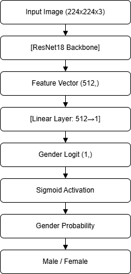

# Face Gender Classification & Face Matching

This repository contains solutions for:
- **Task A:** Gender Classification (Male/Female)
- **Task B:** Face Matching (Identity Verification with Distorted Inputs)

---

## Setup

### 1. Create and Activate a Virtual Environment (Recommended)

It is recommended to use a Python virtual environment to avoid dependency conflicts:

**On Windows:**
```sh
python -m venv venv
venv\Scripts\activate
```
**On macOS/Linux:**
```sh
python3 -m venv venv
source venv/bin/activate
```

### 2. Clone the repository and install dependencies:
```sh
git clone <repo-url>
cd face
pip install -r requirements.txt
```

---

## Task A: Gender Classification 👩‍🦱👨‍🦰

### 🗂 Dataset Structure

```
data/raw/train/
  ├── male/
  └── female/
data/raw/val/
  ├── male/
  └── female/
```

### 📌 Goal

- Train a model to classify faces as male or female using the training set.
- Validate its performance on the validation set.
- Focus on accuracy, generalization, and fairness.

### 🚀 How to Run

1. **Parse the dataset:**
    ```sh
    python parse_utkface.py
    ```
    This generates `train.csv` and `val.csv`.

2. **Train the model:**
    ```sh
    python run_train.py
    ```

3. **Evaluate:**
    ```sh
    python test.py train.csv
    python test.py val.csv
    ```

4. **Single-image prediction:**
    ```sh
    python -m src.predict path/to/image.jpg
    ```

5. **Real-time webcam prediction:**
    ```sh
    python -m src.realtime_predict
    ```

### 📊 Example Results

| Split   | Accuracy | Precision | Recall  | F1-score |
|---------|----------|-----------|---------|----------|
| Train   | 0.9979   | 0.9974    | 1.0000  | 0.9987   |
| Val     | 0.9431   | 0.9322    | 0.9968  | 0.9634   |

---

## Task B: Face Matching (Multi-Class Recognition with Distorted Inputs)

### 📁 Dataset Organization

```
identities/
  ├── id1/
  │     ├── img1.jpg
  │     └── img2.jpg
  ├── id2/
  │     └── img1.jpg
  ...
distorted/
  ├── distorted1.jpg
  ├── distorted2.jpg
  ...
```

### 📌 Goal

- Build a face recognition system that can match distorted/test images to the correct identity folder.
- The system should work even for identities not seen during training (face verification, not classification).

### 🧠 Approach

- Learn a face embedding using a Siamese or Triplet Network (metric learning).
- During inference, compare the embedding of a test/distorted image to all reference images.
- If any reference image is close enough (below a threshold), it’s a positive match (label=1); otherwise, negative (label=0).

### 🚀 How to Run

1. **Train the embedding model** (see your Siamese/Triplet training script).
2. **Run face matching:**  
   Use the provided `match_face` function in your codebase:
   ```python
   identity, label = match_face('distorted/distorted1.jpg', 'identities/', model, transform, threshold=0.7)
   print(f"Predicted identity: {identity}, Match label: {label}")
   ```
   - Returns the matched identity and whether it’s a positive (1) or negative (0) match.

### 📝 Notes

- The model is not restricted to a fixed set of identities.
- Embeddings for the same person (even distorted) are close; different people are far apart.

---

## Project Structure

```
face/
│
├── src/
│   ├── augmentations.py      # Data augmentation and transforms
│   ├── dataset.py            # Custom PyTorch dataset
│   ├── model.py              # DualHeadFaceNet model definition (gender head used)
│   ├── train.py              # Training loop
│   ├── predict.py            # Single-image gender prediction
│   ├── realtime_predict.py   # Real-time webcam gender prediction
│   └── __init__.py
│
├── run_train.py              # Training entry point
├── parse_utkface.py          # Script to parse dataset folders into CSV
├── train.csv                 # Training set CSV (generated)
├── val.csv                   # Validation set CSV (generated)
├── model.pt                  # Trained model weights (generated)
├── test.py                   # Evaluation script
├── .gitignore
├── README.md
└── model_diagram.png         # Model architecture diagram 
```

---

## Model Diagram



---

## Requirements

- Python 3.8+
- torch
- torchvision
- albumentations
- opencv-python
- pandas
- tqdm
- pillow
- scikit-learn

---

## License

Apache License 2.0